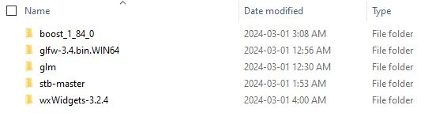
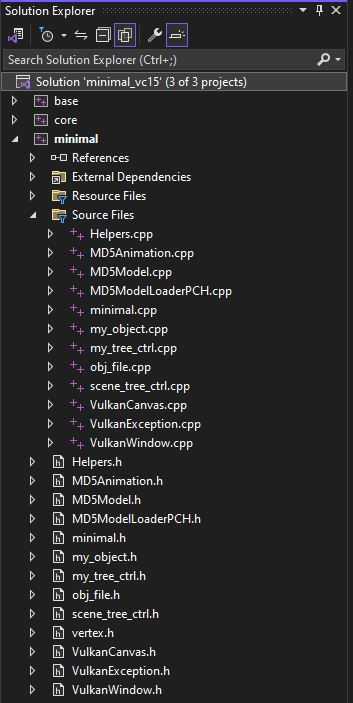
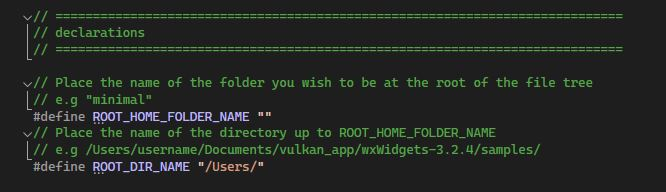

# Vulkan Object Loader
An object loader capable of loading 3D objects and animations using Vulkan.

Overview
--------
This application contains a UI and file explorer made using  wxWidgets  which can be used to select and load 3d models using  Vulkan 

<h3> The user is able to </h3>

 - Look around in a file tree/explorer created using  wxWidgets 
 - Select  .obj  and animated  .md5mesh/.md5anim  files to load into a window using Vulkan 

 - Move around the  3d Vulkan environment  using either  UI  or  mouse controls 

 - View the  objects  loaded and select individual objects using a simple object hierarchy
 -  Manipulate  any selected object

How to Install
--------

<h3> Installing the libraries </h3>

 - Install the <a link = https://vulkan.lunarg.com/ style="color:white;font-weight:bold">Vulkan SDK </a> into the C: folder (using version 1.3.275.0)
 - Download the 64-bit Windows binaries for  <a link = https://www.glfw.org/download style="color:white;font-weight:bold"> glfw </a> (using version 3.4)
 - Download the <a link = https://github.com/g-truc/glm style="color:white;font-weight:bold"> glm library </a> on github
 - Download <a style="color:white;font-weight:bold"> boost </a> (using version 1_84_0)
 - Download <a link = https://github.com/nothings/stb style="color:white;font-weight:bold"> stb-master </a> on github
 - Install <a link = https://www.wxwidgets.org/downloads/ style="color:white;font-weight:bold"> wxWidgets </a> (using version 3.2.4) 

 Place the  glfw, glm, boost, stb-master, and wxWidgets libraries into a single parent directory.

 To build wxWidgets, open `wxWidgets-3.2.4\build\msw\wx_vc15.sln`, then select the `build solution` option after right-clicking the solution in the `Solution Explorer`.

 For boost, run `boost_1_84_0\bootstrap.bat`, then run the file `boost_1_84_0\b2.exe` which should have appeared after running the previous file. A new folder `boost_1_84_0\stage` should appear. If you are having trouble (or are using a different version of boost), follow the guide <a link = https://stackoverflow.com/questions/2629421/how-to-use-boost-in-visual-studio-2010/2655683#2655683 style="color:white;font-weight:bold"> here.</a>

 

<h3> Setting up the solution </h3>

Download the folder named `files-to-place-in-minimal`, then drag the contents of the folder into `wxWidgets-3.2.4\samples\minimal` (not the actual folder itself), then open up `wxWidgets-3.2.4\samples\minimal\minimal_vc15.sln`.

 - At the top of Visual Studio, go into `View -> Other Windows -> Property Manager`
 - In the `Property Manager`, drop down `minimal` and right-click `Debug|x64`, select `Add Existing Property Sheet...` and select the file `PropertySheet.props`
 - Go into `minimal -> Properties -> General -> C++ Language Stantard` while in the `Debug x64` configuration, and select the option with `C++17`
 - At the top of the `Solution Explorer`, select `Show All Files`, right click every file shown in the image below, and select `Include In Project`

 - In `minimal.cpp` at the top, fill out the `ROOT_HOME_FOLDER_NAME` and `ROOT_DIR_NAME` to correspond to whichever directory you like

 

If you use different versions of libraries or have placed them in different locations, you may need to change some of the file paths in `Properties -> VC++ Directories -> Include Directories | Library Directories`, `Properties -> C/C++ -> Additional Include Directories`, and `Properties -> Linker ->  General -> Additional Library Directories`.

How to Use
--------

